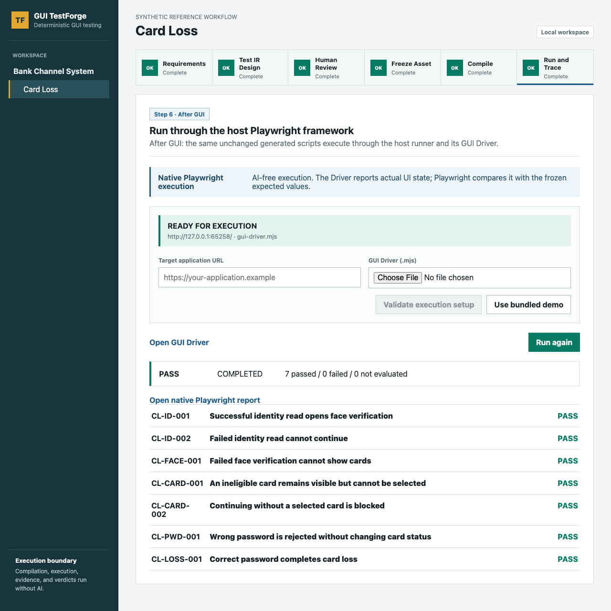

# GUI TestForge

[English](README.md) | [简体中文](README.zh-CN.md)

> 在 GUI 尚未出现时，把原生 GUI 测试脚本编译到你现有的 Playwright 项目中；继续使用原来的 Playwright，执行阶段零 AI。

GUI TestForge 只解决现有 Playwright 流程中的一个关键堵点：测试团队已经知道要验证哪些 GUI 业务行为，但此时还没有可执行程序、Selector、URL 和最终 DOM，因而无法提前完成可执行脚本。

它把经人工审批的语义 Test IR 编译为原生 Playwright spec，并写入使用方项目原有的 `testDir`。使用方继续保留自己的 Playwright 配置、Fixture、Project、Reporter、重试、Trace、CI 和正常的 `playwright test` 命令。



[观看真实端到端演示视频](docs/assets/demo-workflow.webm)

## 五分钟 Demo

前提：Node.js 22 或更高版本。

```bash
git clone https://github.com/jialynmattus28-lang/gui-testforge.git
cd gui-testforge
npm run demo
```

按浏览器中的六个阶段操作。完成当前步骤后系统会自动进入下一步，每个已完成页面也保留手工“下一步”。需求确认、Test IR 审核、冻结、编译和 Playwright 用例发现期间，银行卡挂失被测 GUI 不会启动。

编译完成后，**Run and Trace** 仍会等待被测程序 URL 和 GUI Driver。体验仓库内置流程时，需要明确点击 **Use bundled demo** 装载预制交接输入，然后才能运行未改动的编译脚本。

GUI 前置阶段显示为 `COMPILED / NOT_EVALUATED`：原生脚本已经存在且可被 Playwright 发现，但系统没有宣称任何测试结果。

离线 Demo 不需要 API Key。录制的 AI 提案、被测应用和 GUI Driver 都是预制且可检查的；校验、审批、冻结、原生编译、Playwright 发现、执行和报告均为真实功能。

## 接入现有 Playwright 项目

增加一份冻结 Test IR、一个项目自有 GUI Driver 和一个配置文件：

```javascript
// testforge.config.mjs
export default {
  frozenAsset: './testforge/frozen/card-loss.json',
  outputDir: './tests/generated/testforge',
  testModule: './fixtures/test.mjs',
  driverModule: './testforge/gui-driver.mjs',
  playwrightConfig: './playwright.config.mjs',
  fileExtension: '.spec.mjs',
  fixtureNames: ['page', 'context', 'request'],
};
```

在 GUI 和 URL 尚不存在时先编译，再使用原有 Runner：

```bash
npm run testforge -- compile --config testforge.config.mjs
npm run testforge -- check --config testforge.config.mjs
npx playwright test --list
npx playwright test
```

前三个命令不依赖被测程序。GUI Driver 或被测目标未就绪时，实际执行必须失败或保持 `NOT_EVALUATED`，绝不能产生虚假通过。

可直接查看可运行的[现有 Playwright 项目示例](examples/existing-playwright/README.md)。

## 为什么需要 Test IR

Test IR 冻结业务动作、测试数据和断言，但不保存 CSS Selector、XPath、坐标、URL 或 Playwright 调用。GUI 完成后，开发方只需在 GUI Driver 中把这些语义映射到真实控件。只要业务意图没有变化，冻结资产和生成 spec 都不需要改写。

## 信任边界

- **AI 可以提案：** AI 输出只是未经信任的设计草稿。
- **人工负责审批：** 每条采用的用例都要逐条审核，并与内容哈希绑定后冻结。
- **编译器保持确定性：** 相同冻结输入和配置必须生成完全相同的原生 spec。
- **Playwright 负责判定：** 执行、实际值读取、断言、报告和结果判定都没有 AI 决策。

普通使用者先阅读简明的[用户指南](docs/USER_GUIDE.zh-CN.md)。详细内容见[编译器接入](docs/COMPILER.zh-CN.md)、[GUI Driver](docs/GUI_DRIVER.zh-CN.md)和[设计规格](docs/superpowers/specs/2026-09-20-existing-playwright-integration-design.zh-CN.md)。需要帮助时请查看[支持说明](SUPPORT.zh-CN.md)。

## 当前状态

Playwright 接入已经实现，并按真实现有 Playwright 仓库模式完成验证。Selenium 仍是后续编译目标，当前在界面中保持禁用。

## 许可证

Apache License 2.0，详见 [LICENSE](LICENSE)。

Copyright 2026 吴笛（Dean Wu）。
